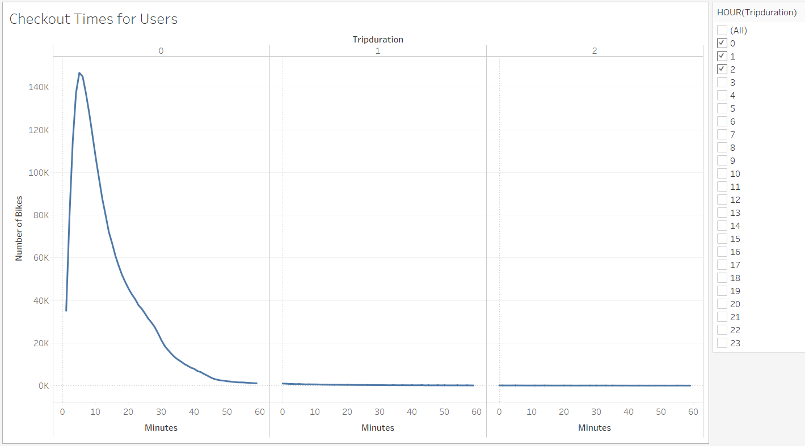
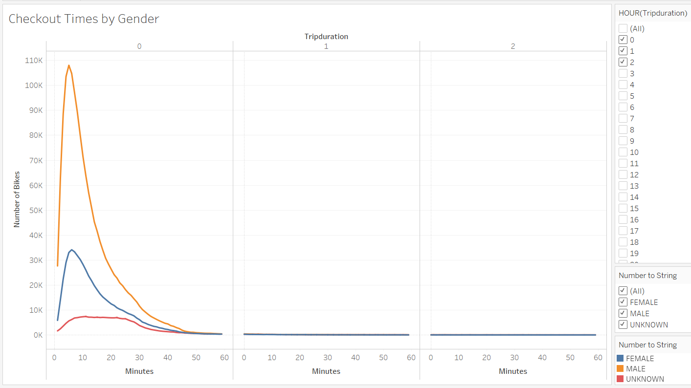
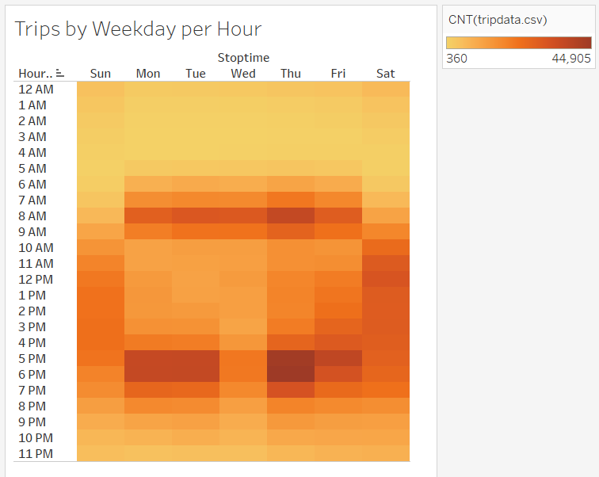
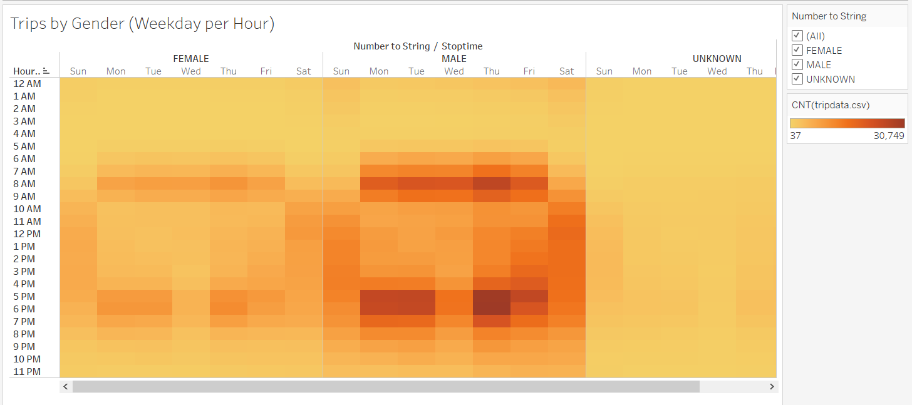
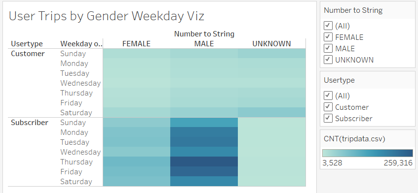
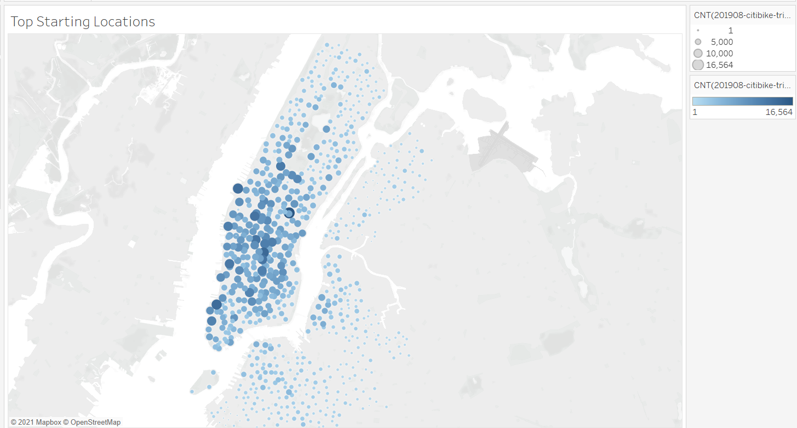
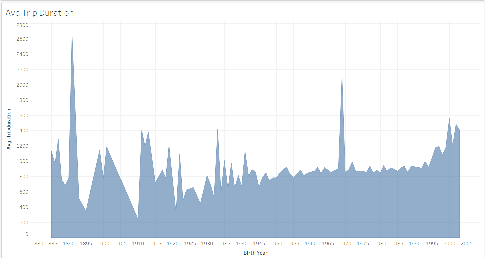
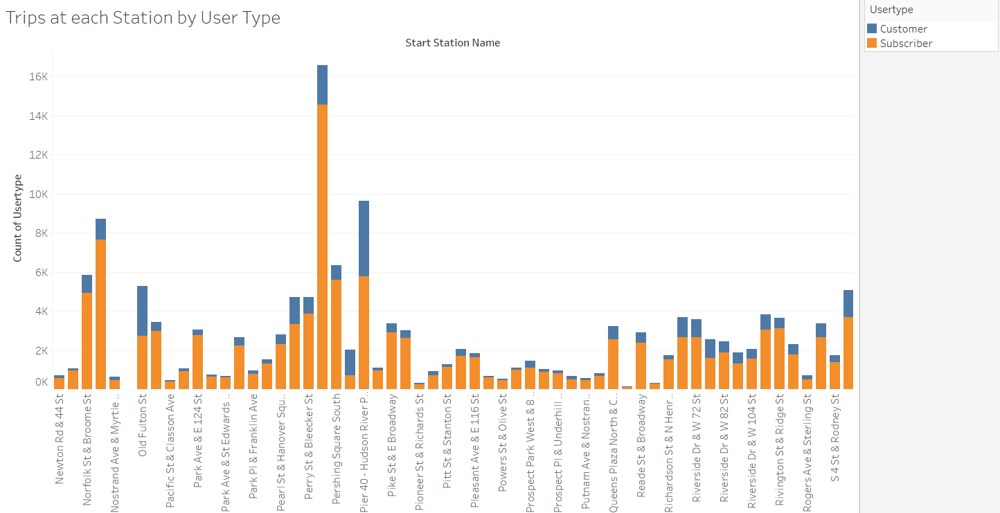
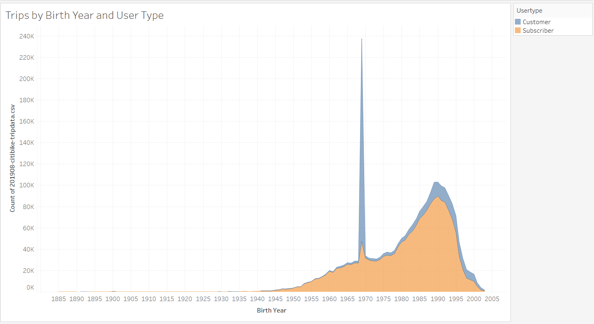

# Bikesharing

## Overview:
A client wants to start a bike sharing business in De Moines. This repository contains visualizations that support the business proposal idea to potential investors. The purpose of this analysis is to provide these investors with a data visualization of biking utilization in New York City. CitiBike data was taken from August 2019 here: [https://s3.amazonaws.com/tripdata/index.html](https://s3.amazonaws.com/tripdata/index.html). 

The visualizations can be viewed on Tableau Public here: [https://public.tableau.com/profile/nguyen.cao3329#!/vizhome/bikesharing_16152399897010/ChallengeStory](https://public.tableau.com/profile/nguyen.cao3329#!/vizhome/bikesharing_16152399897010/ChallengeStory).

## Results:
Below are my findings of visualization of bike riding data from CitiBike in New York City from August 2019.

1. **Checkout Times for Users:** This line chart shows the trends of how long a rider uses a CitiBike for. Users typically ride for less than one hour, with most users riding for 5 minutes.

2. **Checkout Times by Gender:** This line chart shows the trends of how long a rider uses a CitiBike for, based on their reported gender. It can be concluded that more men use CitiBike than women, yet the curve is the same (with most users riding for 5 minutes). 

3. **Trips by Weekday per Hour:** This is a heat map of how many trips were taken every day, by the hour. Looking at the darkest areas, most users ride Monday through Friday from 6AM-10AM and 4PM-6PM. This coincides with the average working day so most users may be using CitiBike as their main source of transportation to work. 

4. **Trips by Gender (Weekday per Hour):** This is a heat map of how many trips are taken every day, by the hour, separated by gender. The results are similar between men versus women, CitBikes was used mainly during rush hour and used consistently during the weekends. Again, we see here there are more male users than female users.

5. **Users Trips by Gender:** this is a heat map of how many trips are taken per weekday, separated by gender and the type of user. There isn’t much difference in user types that were customers for male, female, or unknown. For subscribers, again we see most subscribers are male with Thursday/Friday with the most subscribers riding. 

6. **Top Starting Locations:** This is a map of the top locations that users start at. It can be concluded that most users in New York City start in Manhattan. 

7. **Average Trip Duration:** This is an area chart of the average trip duration based on the birth year of each user. It would seem that most users ride for an average of 900 seconds which is about 15 minutes. Despite the outliers, the amount of time is similar across all ages.

## Summary:
August seems to be a pretty busy season for CitiBike. There are significantly more tourists and the weather is warm so it is expected that there would be more riders. The visualizations show that the peak times are during rush hour and the weekends, most users are men, and most users rent bikes out of Manhattan. Two additional visualizations I would perform are shown below. 

1. **Trips at each Station by User Type:** The stacked bar chart below shows the contrast between customers versus subscribers and which station has the most riders. This can be used to determine how popular each station would be.

2. **Trips by Birth Year and User Type:** This area chart shows how many trips were taken based on both the birth year of the rider and their user type. This can be used to show bike utilization by age and user type. 

